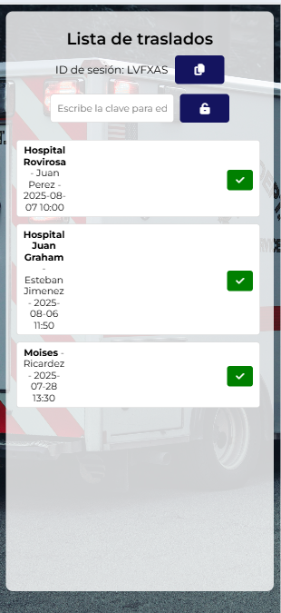

#  Route Planner

**Route Planner** es una aplicación web diseñada para instituciones de salud que coordinan **traslados médicos en ambulancia**. Su propósito es simplificar la asignación y seguimiento de puntos de destino entre personal administrativo y conductores, de forma colaborativa y en tiempo real.

[Pruebalo ahora](https://fcancinos.github.io/route-planner/)

---

## Características principales

-  Lista compartida de traslados diarios
-  Actualización en tiempo real usando base de datos colaborativa
-  Interfaz simultánea para asignadores y conductores
-  Check de cumplimiento para cada destino por parte del conductor
-  Notificaciones visuales de nuevos traslados asignados
-  Compatible con dispositivos móviles y navegadores de escritorio

---

##  Tecnologías utilizadas

| Elemento          | Descripción                                  |
|-------------------|----------------------------------------------|
| HTML / CSS / JS   | Estructura, estilos y lógica frontal         |
| RTDB     | Base de datos en tiempo real (u otra opción) |
| GitHub Pages      |           |

---

## Flujo de uso

1. **Administrador** accede a la app y comienza a asignar destinos.
2. **Conductores** acceden a la lista desde sus dispositivos móviles.
3. Cada nuevo destino aparece automáticamente para todos.
4. Los conductores marcan como **completado** cada traslado.
5. La lista se actualiza en tiempo real para el equipo.

---

[Prueba el Demo ahora](https://fcancinos.github.io/route-planner/)

## Capturas de pantalla

    
    
    

